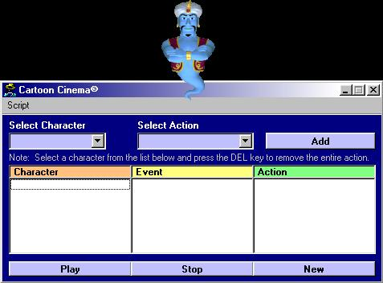



## Cartoon Cinema \(create your own animations\) \- FIXED

### Description

(Fixed the 'Open Dialog' problem)

A fully functional cartoon script creator for MS Agent. Simply select the character, tell it what to do, and add it to the script. This software allows all 4 characters (Genie, Merlin, Peedy, and Robby) to interact with each other however you want them to. Create your script and watch these characters bring it to life! A brief tutorial on how to use this program is explained by the Genie character at startup. Comments and Suggestions are welcome, but DON'T FORGET TO VOTE!!!
 
### More Info
 
Requires MSAgent

             |
---                |---
**Submitted On**   |2000-01-24 08:55:56
**By**             |[CovertLoop](https://github.com/Planet-Source-Code/PSCIndex/blob/master/ByAuthor/covertloop.md)
**Level**          |Advanced
**User Rating**    |4.4 (44 globes from 10 users)
**Compatibility**  |VB 6\.0
**Category**       |[Graphics](https://github.com/Planet-Source-Code/PSCIndex/blob/master/ByCategory/graphics__1-46.md)
**World**          |[Visual Basic](https://github.com/Planet-Source-Code/PSCIndex/blob/master/ByWorld/visual-basic.md)
**Archive File**   |[CODE\_UPLOAD141141242001\.zip](https://github.com/Planet-Source-Code/covertloop-cartoon-cinema-create-your-own-animations-fixed__1-14667/archive/master.zip)

### API Declarations

Packaged in the .zip file you're about to download.

